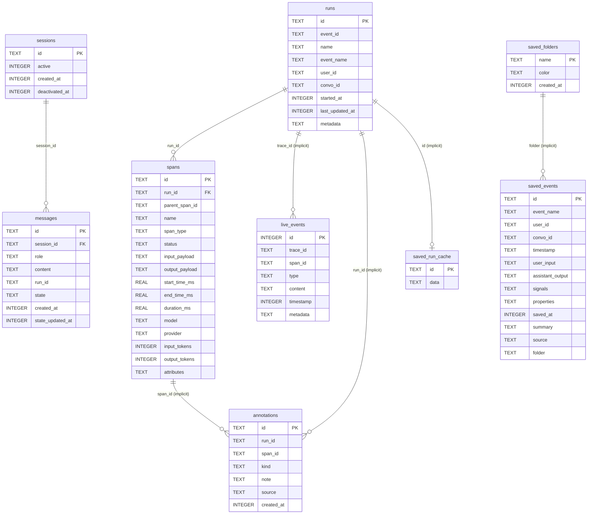

# Database reference

Raindrop Workshop stores every run, span, live event, annotation, and saved
trace in a single local SQLite file. The daemon owns that file: the only
intended access paths are the HTTP API (see `ai-docs/API.md`), the read-only
`POST /api/traces/query` escape hatch documented below, and the `sqlite3` CLI
for one-off inspection.

This document is the contributor-facing source of truth for the schema, the
Drizzle migration workflow, and the operations recipes (backup / reset /
inspect). All line citations point at the upstream source as of the fork
snapshot; see `ai-docs/ARCHITECTURE.md` for the upstream-vs-fork boundary.

---

## Schema overview

Defined in `src/db/schema.ts:1-171`. Drizzle helpers are imported at
`src/db/schema.ts:1-2`; no real foreign keys are declared beyond the two
explicit `references()` calls (`spans.run_id → runs.id` at
`src/db/schema.ts:27` and `messages.session_id → sessions.id` at
`src/db/schema.ts:112`). All other relations are implicit (matched by
convention in queries).

| Table | Kind | Purpose | Drizzle definition |
|---|---|---|---|
| `runs` | table | One row per OTLP trace received by the daemon. | `src/db/schema.ts:4-21` |
| `spans` | table | Individual spans belonging to a run. | `src/db/schema.ts:23-47` |
| `live_events` | table | Streaming events emitted while a run is in flight (text/reasoning deltas, tool start/result). | `src/db/schema.ts:49-61` |
| `saved_run_cache` | table | Cached rendered trace payloads for saved runs. | `src/db/schema.ts:63-66` |
| `saved_events` | table | User-saved chat events with optional folder filing. | `src/db/schema.ts:68-89` |
| `saved_folders` | table | Folder taxonomy for `saved_events`. | `src/db/schema.ts:91-95` |
| `sessions` | table | Sidepanel chat sessions. | `src/db/schema.ts:97-106` |
| `messages` | table | Individual messages inside a sidepanel session. | `src/db/schema.ts:108-124` |
| `annotations` | table | User / agent annotations pinned to a run or span. | `src/db/schema.ts:126-141` |
| `runs_with_hints` | view | `runs` augmented with derived `model`, `finished`, `span_count`, `live_event_count`, `payload_total_chars`. | `src/db/schema.ts:143-170` |

The view is defined inline as a `sqliteView(...).as(sql\`...\`)` at
`src/db/schema.ts:158-170`. Its body joins `runs` against subqueries over
`spans` and `live_events`; it is read-only by construction.

### Pragmas applied at open time

When the daemon opens the database it runs (`src/db.ts:76-79`):

```sql
PRAGMA journal_mode = WAL;
PRAGMA foreign_keys = ON;
```

WAL mode is why `raindrop_workshop.db-wal` and `raindrop_workshop.db-shm`
appear next to the main file. The `workshop reset` command and the manual
backup recipe below all three files together for that reason
(`src/index.ts:307`).

---

## Table-by-table reference

Each table below lists every column with type, nullability, and default, every
declared index, and every foreign key. Citation is the Drizzle definition
itself; types are the SQLite types Drizzle emits (`text` → `TEXT`,
`integer` → `INTEGER`, `real` → `REAL`).

### `runs` — `src/db/schema.ts:4-21`

One row per OTLP trace. Written by `upsertRun` (`src/db.ts:235-263`); the
upsert uses `COALESCE(excluded, existing)` everywhere except `started_at`
(takes the `MIN`) and `last_updated_at` (takes the `MAX`).

| Column | Type | Nullable | Default |
|---|---|---|---|
| `id` | TEXT | NOT NULL | PRIMARY KEY |
| `event_id` | TEXT | NULL | — |
| `name` | TEXT | NULL | — |
| `event_name` | TEXT | NULL | — |
| `user_id` | TEXT | NULL | — |
| `convo_id` | TEXT | NULL | — |
| `started_at` | INTEGER | NOT NULL | — |
| `last_updated_at` | INTEGER | NOT NULL | — |
| `metadata` | TEXT | NULL | — (JSON string) |

Indexes (`src/db/schema.ts:17-20`):

- `idx_runs_last_updated` — `last_updated_at`
- `idx_runs_event_id` — `event_id` WHERE `event_id IS NOT NULL`

No foreign keys.

### `spans` — `src/db/schema.ts:23-47`

The hot table. Every span received through `/v1/traces` becomes one row.

| Column | Type | Nullable | Default |
|---|---|---|---|
| `id` | TEXT | NOT NULL | PRIMARY KEY |
| `run_id` | TEXT | NOT NULL | — (FK → `runs.id`) |
| `parent_span_id` | TEXT | NULL | — |
| `name` | TEXT | NOT NULL | — |
| `span_type` | TEXT | NULL | — |
| `status` | TEXT | NULL | `'UNSET'` |
| `input_payload` | TEXT | NULL | — (opaque string, often JSON) |
| `output_payload` | TEXT | NULL | — (opaque string, often JSON) |
| `start_time_ms` | REAL | NULL | — (epoch ms) |
| `end_time_ms` | REAL | NULL | — (epoch ms) |
| `duration_ms` | REAL | NULL | — |
| `model` | TEXT | NULL | — |
| `provider` | TEXT | NULL | — |
| `input_tokens` | INTEGER | NULL | — |
| `output_tokens` | INTEGER | NULL | — |
| `attributes` | TEXT | NULL | — (JSON string) |

Indexes (`src/db/schema.ts:43-46`):

- `idx_spans_run_id` — `run_id`
- `idx_spans_parent` — `parent_span_id`

Foreign keys: `run_id` → `runs.id` (`src/db/schema.ts:27`).

`status` accepts any string at the DB level, but the daemon writes one of
`UNSET`, `OK`, or `ERROR` (see the OTLP → Drizzle status mapping at
`src/parse.ts:95-108`).

### `live_events` — `src/db/schema.ts:49-61`

Streaming events for a run. Written by `upsertLiveEvent`
(`src/db.ts:562-571`); tailed by `tailLiveEvents` (`src/db.ts:582-610`),
which backs the `GET /api/runs/:id/events` endpoint.

| Column | Type | Nullable | Default |
|---|---|---|---|
| `id` | INTEGER | NOT NULL | PRIMARY KEY AUTOINCREMENT |
| `trace_id` | TEXT | NOT NULL | — (convention: equals `runs.id`) |
| `span_id` | TEXT | NULL | — |
| `type` | TEXT | NOT NULL | — |
| `content` | TEXT | NULL | — |
| `timestamp` | INTEGER | NOT NULL | — (epoch ms) |
| `metadata` | TEXT | NULL | — (JSON string) |

Index (`src/db/schema.ts:60`): `idx_live_trace` — `(trace_id, timestamp)`.

No declared foreign key, but `trace_id` is conventionally equal to a
`runs.id`. `clearAll` deletes these rows alongside `spans` and `runs`
(`src/db.ts:621-627`).

### `saved_run_cache` — `src/db/schema.ts:63-66`

Blobs of already-rendered trace payloads for saved runs. Used by the
`/api/saved-runs/cache/:id` GET / PUT / DELETE trio.

| Column | Type | Nullable | Default |
|---|---|---|---|
| `id` | TEXT | NOT NULL | PRIMARY KEY |
| `data` | TEXT | NOT NULL | — (opaque serialized payload) |

No indexes, no foreign keys.

### `saved_events` — `src/db/schema.ts:68-89`

User-saved chat events imported from Raindrop Cloud or pinned locally. Each
row is an opaque bundle of `event_name`, user input, assistant output,
optional signals/properties metadata, and a folder reference.

| Column | Type | Nullable | Default |
|---|---|---|---|
| `id` | TEXT | NOT NULL | PRIMARY KEY |
| `event_name` | TEXT | NOT NULL | — |
| `user_id` | TEXT | NULL | — |
| `convo_id` | TEXT | NULL | — |
| `timestamp` | TEXT | NOT NULL | — (ISO string, not epoch) |
| `user_input` | TEXT | NULL | — |
| `assistant_output` | TEXT | NULL | — |
| `signals` | TEXT | NULL | — (JSON string) |
| `properties` | TEXT | NULL | — (JSON string) |
| `saved_at` | INTEGER | NOT NULL | — (epoch ms) |
| `summary` | TEXT | NULL | — |
| `source` | TEXT | NULL | — (`'local'` or `'cloud'`) |
| `folder` | TEXT | NULL | — (matches `saved_folders.name`) |

Indexes (`src/db/schema.ts:85-88`):

- `idx_saved_events_saved_at` — `saved_at DESC`
- `idx_saved_events_folder` — `folder`

No declared foreign key, but `folder` matches `saved_folders.name` by
convention. `deleteSavedFolder` nulls out the `folder` column on its members
before deleting the folder row (`src/db.ts:822-827`).

### `saved_folders` — `src/db/schema.ts:91-95`

User-defined folders that group `saved_events`.

| Column | Type | Nullable | Default |
|---|---|---|---|
| `name` | TEXT | NOT NULL | PRIMARY KEY |
| `color` | TEXT | NOT NULL | — (hex color) |
| `created_at` | INTEGER | NOT NULL | — (epoch ms) |

No indexes, no foreign keys. Folder colors are picked from a fixed palette
maintained in `src/db.ts:778-787` when not supplied.

### `sessions` — `src/db/schema.ts:97-106`

Sidepanel chat sessions.

| Column | Type | Nullable | Default |
|---|---|---|---|
| `id` | TEXT | NOT NULL | PRIMARY KEY |
| `active` | INTEGER | NOT NULL | — (boolean as 0/1) |
| `created_at` | INTEGER | NOT NULL | — (epoch ms) |
| `deactivated_at` | INTEGER | NULL | — (epoch ms) |

Index (`src/db/schema.ts:105`):
`idx_sessions_active_created` — `(active, created_at DESC)`.

No foreign keys.

### `messages` — `src/db/schema.ts:108-124`

Messages inside a sidepanel session. Not trace data: this is Workshop chat
history with the assistant. **`POST /api/traces/query` refuses to read this
table** — see the SQL guard at `src/db.ts:161`, enforced by
`assertReadOnlyTraceQuery` at `src/db.ts:191-193`.

| Column | Type | Nullable | Default |
|---|---|---|---|
| `id` | TEXT | NOT NULL | PRIMARY KEY |
| `session_id` | TEXT | NOT NULL | — (FK → `sessions.id`) |
| `role` | TEXT | NOT NULL | — (enum: `user` \| `assistant`) |
| `content` | TEXT | NOT NULL | — |
| `run_id` | TEXT | NULL | — |
| `state` | TEXT | NOT NULL | — (enum: `pending` \| `delivered` \| `processing` \| `done` \| `error` \| `timeout`) |
| `created_at` | INTEGER | NOT NULL | — (epoch ms) |
| `state_updated_at` | INTEGER | NOT NULL | — (epoch ms) |

Indexes (`src/db/schema.ts:120-123`):

- `idx_messages_session_created` — `(session_id, created_at ASC)`
- `idx_messages_state` — `(state, state_updated_at)`

Foreign keys: `session_id` → `sessions.id` (`src/db/schema.ts:112`).

### `annotations` — `src/db/schema.ts:126-141`

Run- or span-level annotations written through `POST /api/annotations` and
read through `GET /api/annotations?run_id=...` and the run outline.

| Column | Type | Nullable | Default |
|---|---|---|---|
| `id` | TEXT | NOT NULL | PRIMARY KEY |
| `run_id` | TEXT | NOT NULL | — |
| `span_id` | TEXT | NULL | — (when null, the annotation is run-level) |
| `kind` | TEXT | NOT NULL | — (enum: `issue` \| `good` \| `note`) |
| `note` | TEXT | NULL | — |
| `source` | TEXT | NOT NULL | — (enum: `user` \| `claude-code` \| `codex`) |
| `created_at` | INTEGER | NOT NULL | — (epoch ms) |

Indexes (`src/db/schema.ts:137-140`):

- `idx_annotations_run` — `run_id`
- `idx_annotations_span` — `span_id` WHERE `span_id IS NOT NULL`

No declared foreign key, but `run_id` matches `runs.id` and `span_id`
matches `spans.id` by convention. Deleting a run via `DELETE /api/runs/:id`
does **not** cascade to annotations (see `deleteRun` at `src/db.ts:339-345`,
which only deletes `spans`, `live_events`, and `runs`).

### `runs_with_hints` (view) — `src/db/schema.ts:143-170`

A read-only view that augments `runs` with derived columns the run list
endpoint depends on (`src/db.ts:408-415`, `src/db.ts:441-468`).

Columns: every column of `runs` plus:

| Derived column | Type | Derivation |
|---|---|---|
| `model` | TEXT | First non-null `spans.model` for the run (`src/db/schema.ts:161`). |
| `finished` | INTEGER | `1` if every root span has status `OK` or `ERROR`, else `0` (`src/db/schema.ts:162-165`). |
| `span_count` | INTEGER | `COUNT(*)` over `spans` for the run (`src/db/schema.ts:166`). |
| `live_event_count` | INTEGER | `COUNT(*)` over `live_events` for the run (`src/db/schema.ts:167`). |
| `payload_total_chars` | INTEGER | Sum of `LENGTH(input_payload) + LENGTH(output_payload)` over `spans` (`src/db/schema.ts:168-169`). |

The view is a `SELECT r.*, <subqueries> FROM runs r`; the subqueries are
correlated on `runs.id`. Treat the view as the canonical way to read runs
from new code — it matches what the UI list renders.

---

## ER diagram

The figure below renders inline on GitHub. Edge labels show the joining
column; `1—*` means one parent row may have many child rows.



Only the two solid foreign keys (`spans.run_id → runs.id`,
`messages.session_id → sessions.id`) are enforced by SQLite; everything
labelled "implicit" is enforced by application code, not by the database.

---

## Migration workflow

The project uses Drizzle Kit. Schema changes start in
`src/db/schema.ts`, become journaled SQL files under `drizzle/`, get
embedded into the daemon binary at build time, and are applied lazily on the
next daemon start.

### The three commands

| Command | When to run | What it does |
|---|---|---|
| `bun run db:generate` | After editing `src/db/schema.ts`. | Runs `drizzle-kit generate` (writes a new `.sql` file and updates `drizzle/meta/_journal.json`) and then `bun scripts/embed-migrations.ts` (regenerates `src/db/migration-assets.ts`). Source: `package.json:28`. |
| `bun run db:embed` | When `drizzle/*.sql` changed but `src/db/schema.ts` did not. | Runs only `bun scripts/embed-migrations.ts`. Use this if you have hand-edited a migration. Source: `package.json:29`. |
| `bun run db:migrate` | Dev only — applies pending migrations to your local DB using Drizzle Kit's own migrator. | Runs `drizzle-kit migrate`. Source: `package.json:30`, `drizzle.config.ts:9-15`. |

The release build additionally runs `bun scripts/embed-migrations.ts --check`
as the first step of `bun run build` (`package.json:18`) — if the embedded
assets are stale, the build fails.

### Where generated SQL lives

`drizzle.config.ts:10-12` sets:

```ts
schema: "./src/db/schema.ts",
out: "./drizzle",
dialect: "sqlite",
```

So `drizzle-kit generate` emits:

- One `drizzle/<tag>.sql` per migration (e.g. `drizzle/0000_initial.sql`).
- `drizzle/meta/_journal.json` — the ordered migration manifest.

`bun scripts/embed-migrations.ts` reads that journal, asserts every
referenced `.sql` file exists (`scripts/embed-migrations.ts:73-77`), asserts
there are no orphan `.sql` files (`scripts/embed-migrations.ts:84-90`), and
writes `src/db/migration-assets.ts` (`scripts/embed-migrations.ts:31`,
`:92-117`). That generated module exports the journal plus a
`with { type: "file" }` import per migration so Bun embeds the bytes into
the compiled binary.

### How the daemon applies migrations at runtime

`getDrizzleDb` (`src/db.ts:71-90`) opens the SQLite file and then runs:

```ts
migrate(_drizzleDb, { migrationsFolder: resolveMigrationsFolder() });
```

`resolveMigrationsFolder` (`src/db.ts:28-58`) prefers the source tree:

1. If `./drizzle/meta/_journal.json` exists relative to the daemon module
   (`src/db.ts:29-32`), use that. This is the path used in `bun run dev` /
   `bun run dev:server`.
2. Otherwise, materialise the embedded migrations into
   `~/.raindrop/migrations/<VERSION>/` (where `<VERSION>` is the daemon
   version from `src/version.ts`). It writes the journal and every `.sql`
   file there, atomically renaming a temp dir into place
   (`src/db.ts:36-58`). This is the path used by the installed `raindrop`
   binary.

If migration fails, `getDrizzleDb` closes the database and throws with a
message that points the user at `raindrop workshop reset`
(`src/db.ts:82-88`).

### Adding a column — worked example

> Add `input_cost_usd INTEGER` to `spans`.

1. Edit `src/db/schema.ts` — add the column inside the `spans` table block.
2. Run `bun run db:generate`. This produces (a) a new
   `drizzle/<tag>.sql` file with the `ALTER TABLE spans ADD COLUMN ...`
   statement, (b) an updated `drizzle/meta/_journal.json`, and (c) a
   regenerated `src/db/migration-assets.ts`.
3. Commit all three: the new SQL file, the journal update, and
   `src/db/migration-assets.ts`. **All three are required** — the
   `--check` step in `bun run build` will fail otherwise.
4. Restart the daemon. `getDrizzleDb` runs `migrate()` automatically.

You do **not** need to write SQL by hand unless you want to add a
data-backfill migration, in which case edit the generated `.sql` file
before committing.

### Resetting the migrations cache

If `~/.raindrop/migrations/<VERSION>/` gets out of sync (e.g. you
hand-edited an embedded SQL file), delete it:

```bash
rm -rf ~/.raindrop/migrations
```

The next daemon start will re-extract from the binary.

---

## Database file location and env var reference

### Path resolution

`resolveDbPath` (`src/db.ts:20-26`):

```ts
const explicit = process.env[WORKSHOP_DB_PATH_ENV_VAR];
if (explicit && explicit.trim()) {
  return explicit;
}
return path.join(os.homedir(), ".raindrop", "raindrop_workshop.db");
```

| Env var | Default | Notes |
|---|---|---|
| `RAINDROP_WORKSHOP_DB_PATH` | `~/.raindrop/raindrop_workshop.db` | Absolute path to the SQLite file. Parent directory is created on first open (`src/db.ts:74`). Changing this value does **not** migrate existing data — the new path starts empty. |

`drizzle.config.ts:5-7` mirrors the same default for `bun run db:migrate` /
`bun run db:studio`:

```ts
const dbPath =
  process.env.RAINDROP_WORKSHOP_DB_PATH ||
  path.join(os.homedir(), ".raindrop", "raindrop_workshop.db");
```

So `drizzle-kit` and the daemon always agree on which file to touch.

The CLI also surfaces the default in its help output (`src/index.ts:752-753`)
and in the `workshop status` command, which prints the resolved path on
disk. The uninstaller deletes the file from the well-known location
(`src/uninstall.ts:411`).

### Putting the DB on a different volume

Because path resolution is purely env-driven, you can relocate the file
without symlinks:

```bash
export RAINDROP_WORKSHOP_DB_PATH=/data/raindrop/workshop.db
raindrop workshop start
```

Caveats:

- **Existing data does not auto-migrate.** If the previous DB lived at the
  default path, copy the three files (`workshop.db`, `workshop.db-wal`,
  `workshop.db-shm`) over by hand if you want to keep history.
- **The daemon must be stopped before you move the files.** `bun:sqlite`
  holds open handles; copying a live WAL file gives you a corrupt snapshot.
- **The reset command (below) respects the env var.** `raindrop workshop
  reset` deletes whatever `getDbPath()` resolves to, not just the default
  location.

---

## Read-only SQL escape hatch: `POST /api/traces/query`

For exploration that does not fit the structured endpoints, the daemon
exposes a tightly-scoped read-only SQL passthrough. Implementation:
`queryTraces` at `src/db.ts:197-224`; HTTP handler at `src/server.ts:1008`.

What the guard (`assertReadOnlyTraceQuery`, `src/db.ts:169-195`) enforces:

- Only `SELECT` (or `WITH` … but CTEs are explicitly rejected at
  `src/db.ts:182-184`).
- Single statement — a trailing `;` is allowed but a `;` inside the body is
  not (`src/db.ts:173-175`).
- Blocked keywords (case-insensitive, `\b`-anchored): `attach`, `detach`,
  `insert`, `update`, `delete`, `replace`, `drop`, `alter`, `create`,
  `pragma`, `vacuum`, `reindex`, `analyze` (`src/db.ts:141`).
- Blocked output-amplifying SQL functions: `randomblob`, `zeroblob`,
  `printf`, `format`, `hex`, `quote`, `group_concat`, `json_group_array`,
  `json_group_object` (`src/db.ts:142-156`).
- Blocked tables: `messages` (`src/db.ts:161`, enforced at
  `src/db.ts:191-193`). The `messages` table holds Workshop sidepanel chat
  history and is not trace data.
- Result is hard-capped at `min(limit, 1000)` rows and `min(maxBytes,
  1_000_000)` JSON bytes (`src/db.ts:200-215`); truncation is reported
  back to the caller.

The response shape is `{ columns, rows, row_count, truncated, elapsed_ms }`
(`src/db.ts:133-139`).

---

## Operations recipes

Each recipe is copy-pasteable. Replace `$DB` with the resolved path if you
have overridden `RAINDROP_WORKSHOP_DB_PATH`; otherwise it defaults to
`~/.raindrop/raindrop_workshop.db`.

### Back up the database

The daemon may be running; SQLite WAL mode makes a file copy safe as long
as you grab all three files atomically.

```bash
# Purpose: snapshot the live DB to a timestamped backup
ts=$(date -u +%Y%m%dT%H%M%SZ)
cp ~/.raindrop/raindrop_workshop.db     "$HOME/raindrop_workshop.$ts.db"
cp ~/.raindrop/raindrop_workshop.db-wal "$HOME/raindrop_workshop.$ts.db-wal" 2>/dev/null || true
cp ~/.raindrop/raindrop_workshop.db-shm "$HOME/raindrop_workshop.$ts.db-shm" 2>/dev/null || true
```

For a quiesced snapshot, stop the daemon first:

```bash
# Purpose: quiesced backup with no live WAL
raindrop workshop stop
cp ~/.raindrop/raindrop_workshop.db "$HOME/raindrop_workshop.$(date -u +%Y%m%dT%H%M%SZ).db"
raindrop workshop start
```

### Reset (destructive)

The supported path is the CLI subcommand at `src/index.ts:269-332`. It
stops a running daemon if necessary, prompts for confirmation, then removes
the main file plus its WAL/SHM siblings.

```bash
# Purpose: wipe all local trace data and start fresh
raindrop workshop reset
```

Type `Y` at the prompt. The command refuses to proceed if the daemon is
still running after a stop attempt (`src/index.ts:300-303`).

Manual equivalent (no confirmation prompt — be careful):

```bash
# Purpose: same as `raindrop workshop reset` but with no guardrails
raindrop workshop stop
rm -f ~/.raindrop/raindrop_workshop.db ~/.raindrop/raindrop_workshop.db-wal ~/.raindrop/raindrop_workshop.db-shm
```

### Inspect with `sqlite3`

```bash
# Purpose: open the DB read-only from a shell
sqlite3 -readonly ~/.raindrop/raindrop_workshop.db
```

Once in the REPL:

```sql
-- List every table and view
.tables

-- Show the schema of one table
.schema spans

-- Count rows per table
SELECT 'runs'        AS t, COUNT(*) FROM runs
UNION ALL SELECT 'spans',        COUNT(*) FROM spans
UNION ALL SELECT 'live_events',  COUNT(*) FROM live_events
UNION ALL SELECT 'annotations',  COUNT(*) FROM annotations
UNION ALL SELECT 'messages',     COUNT(*) FROM messages
UNION ALL SELECT 'sessions',     COUNT(*) FROM sessions
UNION ALL SELECT 'saved_events', COUNT(*) FROM saved_events;

-- Recent runs (use the view, not the base table)
SELECT id, name, started_at, last_updated_at, span_count, finished
FROM runs_with_hints
ORDER BY last_updated_at DESC
LIMIT 10;

-- One span by id
SELECT id, run_id, name, span_type, status, duration_ms, model
FROM spans WHERE id = ?;
```

Drizzle Studio is also available as a browser UI:

```bash
# Purpose: launch Drizzle Studio against the same DB path
bun run db:studio
```

It respects `RAINDROP_WORKSHOP_DB_PATH` via `drizzle.config.ts:5-7`, so it
opens the same file the daemon uses.

---

## See also

- `ai-docs/ARCHITECTURE.md` — where `src/db.ts` and `src/db/schema.ts` fit
  in the end-to-end data flow, and the upstream-vs-fork ownership tag for
  each database module.
- `ai-docs/API.md` — HTTP routes that surface these tables (`/api/runs`,
  `/api/spans/:id`, `/api/traces/query`, `/api/annotations`, etc.) and the
  WebSocket events that fire when rows change.
- `ai-docs/PLUGIN-CONTRACT.md` — what gets written into `spans` and
  `live_events` by ingest, and the required vs. optional fields the
  ingester expects from a plugin.
- `ai-docs/DEVELOPMENT.md` — `bun run db:generate` / `db:embed` /
  `db:migrate` script index and the smoke-test recipe that exercises a
  fresh DB.
